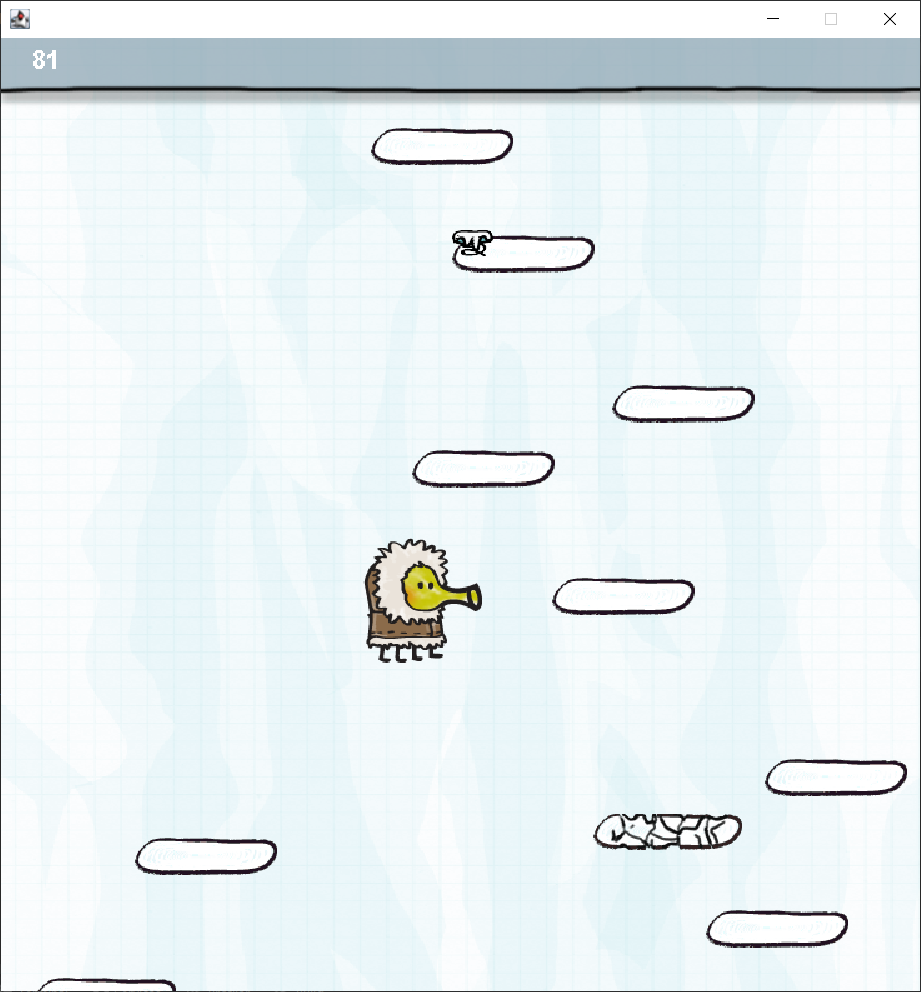
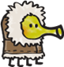
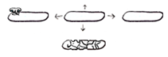
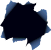
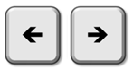

# Doodle Jump
## Feladat ismertetése
A népszerű mobiltelefonos játék mintájára készült, melyben egy karaktert avagy Doodler-t irányíthatunk, jelen esetben a billentyűzet jobb és bal nyíl gombjaival. A játék célja, hogy minél magasabbra jussunk, platformról platformra ugrálva. Ezt addig csinálhatjuk, amíg kedvünk tartja, a játéknak nincs határa. A játék akkor ér véget, ha szándékosan vagy véletlenül elrontjuk azzal, ha egyik platformra se sikerül ráugranunk és leesünk. Nehezítésképpen a pályán feketelyukak is megjelenhetnek amik magukba szívnak, így bármilyen irányból való érintkezéssel elveszítjük a játékot. Azok az elemek, melyek eltűntek alattunk, már nem léteznek a játékos számára, így nem tudunk egy korábbi platformra érkezni, amin már azelőtt is voltunk. Többféle platformmal találkozhatunk a játék közben. Vannak, melyek mozognak jobbra-balra, felfelé-lefelé, vannak, melyek eltűnnek a ráugrás következtében, ezért mindig körültekintően és óvatosan kell a felfelé vezető útvonalat megválasztani. A rugó tárgy is könnyítheti utunkat, ha felvesszük, ugyanis magasabb ugrást biztosít nekünk.

## A játék menete
A talajról kiindulva, platformokra felugrálva kell egyre feljebb jutnunk. A platformok azonnal felrepítenek a levegőbe, így a felhasználónak csak a balra-jobbra mozgatást kell irányítania, ám a különböző platformok mind más és más lehetőségeket és egyben veszélyeket tartogatnak a karakterünknek, miközben ellenségekkel és segítségekkel is találkozik a felfele úton. Csak a képernyőn éppen látható rész aktív a játék során, a már túlhaladt részekre visszamenni nem lehet, ha a Doodler leesik, akkor vége a játéknak. A játék végén egy felugró ablakba írhatjuk a nevünket, így szerepelhetünk a dicsőséglistán.

## A karakter:
 
A játék során irányított karakterünk a Doodler. Balra-jobbra mozgathatjuk, ahogy a platformokról automatikusan elrugaszkodik.
## Platformok:
  
A játékos a felfelé jutást a különböző platformok érintésével teheti meg, melyek más-más tulajdonságokkal rendelkeznek. Vannak, melyek mozognak jobbra-balra, felfelé-lefelé, vannak, melyek kettétörnek a ráugrás következtében.
## Ellenségek:
 
A pályán megjelenhetnek úgynevezett feketelyukak, amik ha nem vigyázunk magukba szippantanak és vége a játéknak.
## Irányítás:
 
A karaktert a bal és jobb nyilak segítségével irányíthatjuk, valamint a P billentyű lenyomásával szüneteltethetjük a játékot.